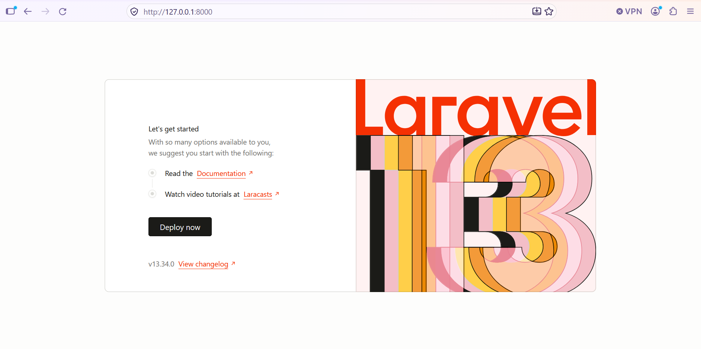
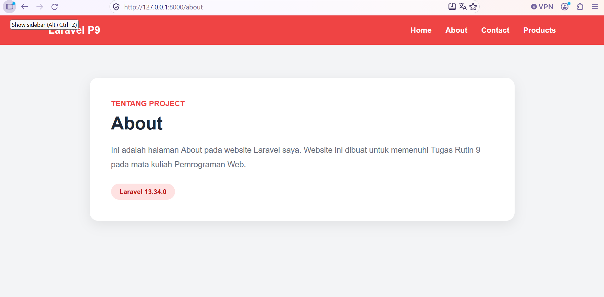
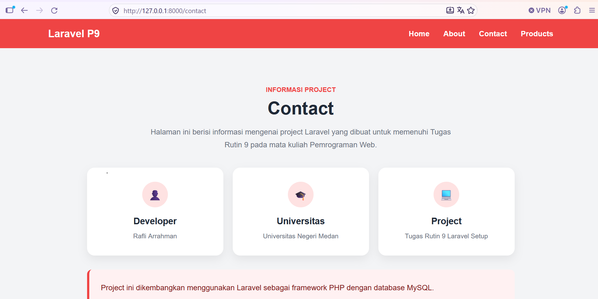
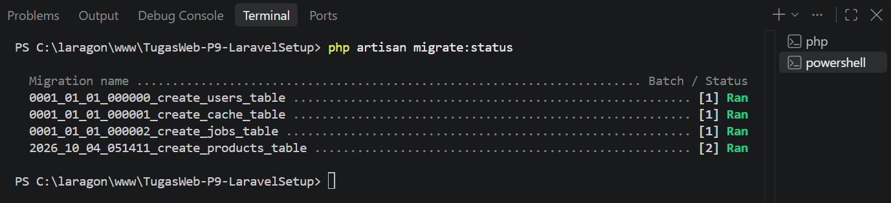
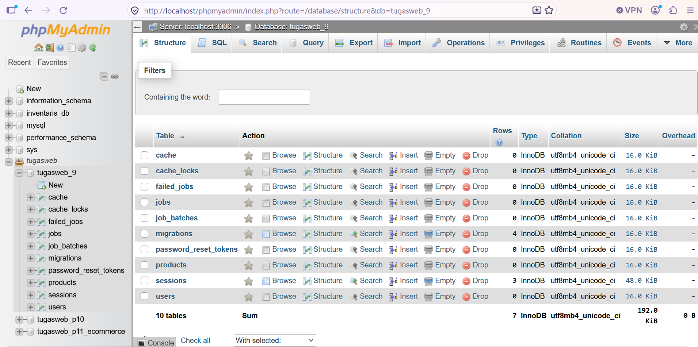
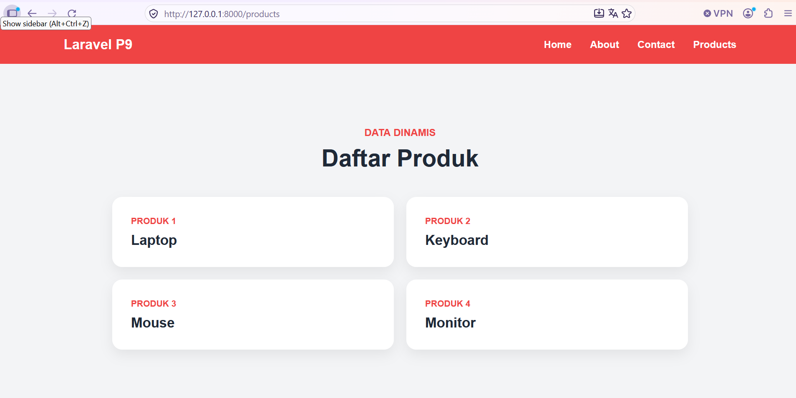

# Tugas Web Programming - P9 Laravel Setup

## Identitas

- **Nama:** Rafli Arrahman
- **Mata Kuliah:** Pemrograman Web
- **Tugas:** Tugas Rutin 9 - Setup Laravel

## Deskripsi

Project ini dibuat untuk memenuhi Tugas Rutin 9 pada mata kuliah Pemrograman Web.

Project menggunakan Laravel sebagai framework PHP dan MySQL sebagai database.

## Teknologi yang Digunakan

- PHP 8.3.33
- Laravel 13.34.0
- MySQL
- Composer
- Laragon
- phpMyAdmin
- Visual Studio Code

## Cara Instalasi

### 1. Clone Repository

```bash
git clone https://github.com/rafliarrahman14-pixel/TugasWeb-P9-LaravelSetup.git
cd TugasWeb-P9-LaravelSetup
```

### 2. Install Dependencies

```bash
composer install
```

### 3. Konfigurasi Environment

Salin file `.env.example` menjadi `.env`, kemudian sesuaikan konfigurasi database MySQL dengan database lokal yang digunakan.

### 4. Generate Application Key

```bash
php artisan key:generate
```

### 5. Jalankan Aplikasi

```bash
php artisan serve
```

Buka `http://127.0.0.1:8000` pada browser.

## Dokumentasi Screenshot

Berikut dokumentasi hasil pengerjaan Tugas Rutin 9 - Setup Laravel.

### 1. Halaman Welcome


### 2. Halaman About


### 3. Halaman Contact


### 4. Status Migration


### 5. Struktur Database


### 6. Data Dinamis Produk

